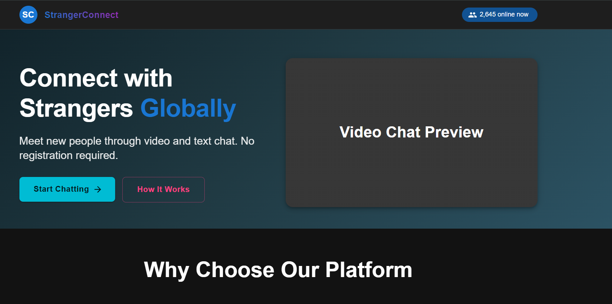

# Real-Time Video Chat App

A web application enabling real-time video chat between users. The project is divided into frontend and backend components, leveraging modern technologies for seamless communication.

## Screen Output

Below is a sample screenshot of the application's video chat interface:



The interface displays local and remote video streams, along with controls for muting, ending calls, and toggling video.

## Tech Stack

- **Frontend:** React, WebRTC, Socket.io-client, CSS
- **Backend:** Node.js, Express, Socket.io

## Project Structure

```
real-time-video-chat-app/
├── backend/
├── frontend/
└── README.md
```

## How to Use

1. **Clone the repository:**

   ```bash
   git clone https://github.com/rahulkbharti/real-time-video-chat.git
   cd real-time-video-chat-app
   ```

2. **Install dependencies:**

   - Backend:
     ```bash
     cd backend
     npm install
     ```
   - Frontend:
     ```bash
     cd frontend
     npm install
     ```

3. **Start the develompment servers:**

   - Backend:
     ```bash
     npm run dev
     ```
   - Frontend:
     ```bash
     npm run dev
     ```

4. **Access the app:**  
   Open your browser and navigate to `http://localhost:5173/`.

---

## Contribution Guidelines

### Frontend

- All frontend code is in the `frontend/` directory.
- Use React functional components and hooks.
- Follow existing code style and naming conventions.
- Submit pull requests with clear descriptions.

### Backend

- All backend code is in the `backend/` directory.
- Use Express for API endpoints and Socket.io for real-time communication.
- Write modular and well-documented code.
- Add tests where applicable.

---

## Issues & Support

- Report bugs or request features via GitHub Issues.
- For major changes, open an issue first to discuss your ideas.

---

**Happy Coding!**
